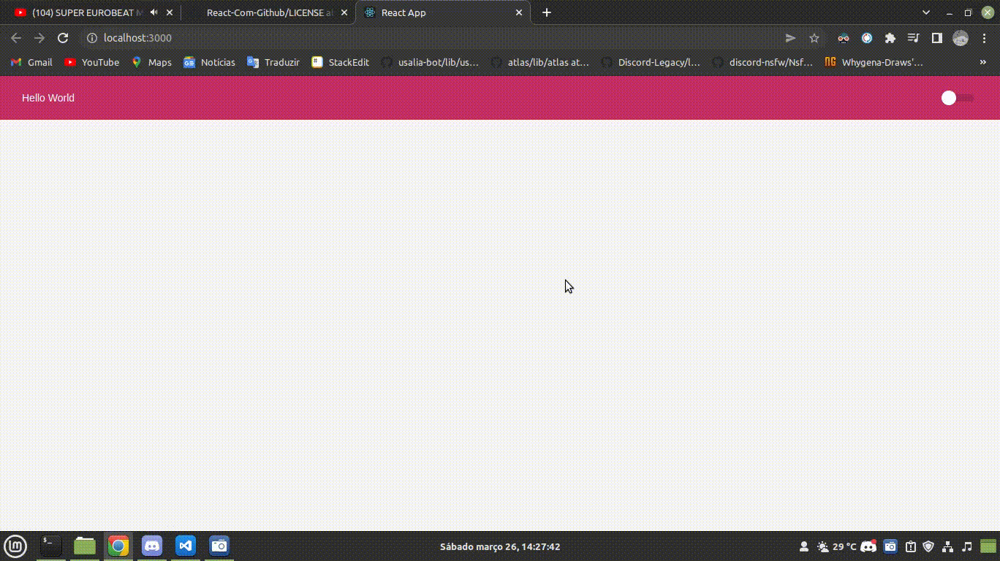

<h1 style="text-align:center">Dark Switch</h1>
<br>
<div align="center">
    
    
    
</div>
<br>

<div align="center">
    
</div>

<div align="center">
    <a href="#sobre">Sobre</a> | 
    <a href="#run">Rodando o projeto</a>
</div>

<a id="sobre"></a>

## 🍓 Sobre

Um teste em react que foi feito com função de trocar os temas entre Dark e Light. O mesmo tem afunção de armazenar o tema escolhido para não ser modificado na hora do reload.

**_Só que ainda acho que o tema dark devia ser o padrão_**

## :running: Rodando o projeto

### DEV Containers

A aplicação tem suporte para **[DevContainers](https://code.visualstudio.com/docs/remote/containers)**, para rodar basta ter o **[Docker](https://www.docker.com)** rodando na maquina e o VsCode para entrar no container de desenvolvimento.

### 📂 Rodando através da fonte.

#### 1. Pré-requisitos:

- **[Node.js](https://nodejs.org/en/)**, **[Git](https://git-scm.com/)** e um gerenciador de pacotes (**[NPM](https://www.npmjs.com/)** ou **[Yarn](https://yarnpkg.com/)**) instalados na máquina.

#### 2. Instalando dependências

```bash
$ npm install
# ou
$ yarn install
```

#### 3. Iniciando

```bash
$ npm run start
# ou
$ yarn start
```

### 🔖 Licença

Caso queira conferir a licença do projeto, só olhar esse arquivo [LICENSE](./LICENSE)
